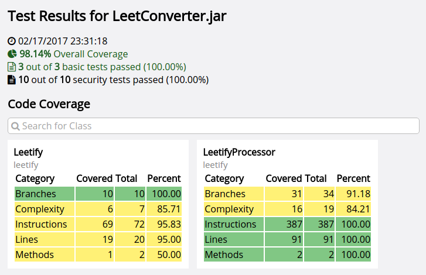

# IDT Contest Submission
Contest Submission for TJHSST 01

<p align="center">
    
</p>

## Contest requirements
For a list of software requirements and information about how our team met these requirements, click [here](Requirements.md).

## Software documentation
### Running the Solution
You can run the solution by using the following command in the same folder as the JAR file:
```bash
java -jar com.idtus.contest.winter2017.framework.jar
```
### Development
You can set up the eclipse project by running the following commands:
```bash
git clone https://github.com/ezwang/IDT-Contest-2017.git
cd IDT-Contest-2017/com.idtus.contest.winter2017.framework
mvn eclipse:eclipse
```
In eclipse, go to `File -> Import` and select `General -> Existing Projects into Workspace`. Select the `IDT-Contest-2017/com.idtus.contest.winter2017.framework` folder as the root folder, and click finish.

### Exporting
You can create an executable JAR file using the following commands:
```bash
cd IDT-Contest-2017/com.idtus.contest.winter2017.framework
mvn package
```
Your JAR file will be located in `IDT-Contest-2017/com.idtus.contest.winter2017.framework/target/com.idtus.contest.winter2017.framework.jar`.


## Product documentation

```
usage: com.idtus.contest.winter2017.framework [-bbTests <arg>] [-h]
       [-html] [-htmlPath <arg>] [-jacocoAgentJarPath <arg>]
       [-jacocoOutputPath <arg>] [-jarToTestPath <arg>] [-noJson]
       [-threads <arg>] [-timeGoal <arg>] [-toolChain] [-verbose]
 -bbTests <arg>              number of exploratory black box tests to run
                             (default: 1000 iterations)
 -h,--help                   display this help message
 -html                       generate detailed html output to file
 -htmlPath <arg>             html output file path
 -jacocoAgentJarPath <arg>   path to the jacoco agent jar
 -jacocoOutputPath <arg>     path to directory for jacoco output
 -jarToTestPath <arg>        path to the executable jar to test
 -noJson                     disable converting test cases to json
 -threads <arg>              number of threads to use for tests (default:
                             4 threads)
 -timeGoal <arg>             maximum time limit for exploratory black box
                             tests to run (default: 300 seconds)
 -toolChain                  only output YAML summary
 -verbose                    enable output of additional information
```

The solution executes two types of tests: basic tests, and black-box tests. Tests are executed in a multithreaded fashion, using workers from a fixed-size thread pool. The default number of threads is 4, but this can be adjusted using the `-threads` parameter.

To specify only YAML output, the `-toolChain` parameter can be specified. This may enable the solution to be integrated into other software that handles building code, such as a continuous integration system.

### JaCoCo code coverage

The JaCoCo is used by the solution to measure code coverage. Instrumenting the execution of code requires the JaCoCo agent JAR. This can be specified with the `-jacocoAgentJarPath`; alternatively, a temporary copy of the jar is bundled with the solution by default and extracted. JaCoCo also requires a directory to store its output files; if this is not specified, a temporary directory is used. All temporary files are deleted upon exit.

### TestBounds map

In order to properly execute, the solution must load information from a TestBounds map. This map is loaded from either a JSON file with the same name as the JAR under test, and in the same directory. If the JSON file cannot be found, an attempt is made to automatically extract it from a class inside the JAR under test whose class name is equal to the main class name with `TestBounds` appended, in that order of preference. Unless the `-noJson` option is specified, the extracted JSON file is then saved where it will be loaded next time, so that it can be easily modified.

Following is a brief explanation of the format of the TestBounds class, with pseudo-type names for readability. Note that these types do not correspond to those used by the solution, which parses the TestBounds map into its own classes.

**TestBoundsMap**
```
{
    "tests": List<TestMap>,
    "dependent parameters": Map<String, Either<ParamMap, List<ParamMap>>>,
    "fixed parameter list": List<ParamMap>
}
```

**TestMap**
```
{
    "parameters": ArrayList<Object>,  // parameters to pass to the jar in question
    "stdOutExpectedResultRegex": String,  // regex to match against stdout
    "stdErrExpectedResultRegex": String,  // regex to match against stderr
}
```

**ParamMap**
```
{
    "type": Class,
    "format": String,
    "enumerated values": List<String>,
    "optional": Boolean,
    "min": Object,
    "max": Object
}
```

### Basic tests

The basic tests for the solution are loaded from the `"tests"` key in the TestBounds map. They consist of hardcoded pairs of inputs, which are executed by the solution. The solution then compares the standard output and standard error emitted by the software under test with regexes provided by the TestMap. The solution always executes the basic tests first, and records the resulting code coverage.

### Advanced tests

The black-box tests for the solution are generated using various methods, the primary one being randomized tests from the `"fixed parameter list"` or `"dependent parameter list"` keys in the TestBounds map. Tests are also generated, though in smaller number, by modifying the basic tests, or by creating test inputs from scratch.

Since the goal of these tests is to generate exceptions that may not have otherwise been caught, any exceptions that occur during the advanced testing phase are stored and logged for later inspection. If verbose output is requested, the solution also prints the output of the software under test to standard output.

The solution accepts a test time goal with `-timeGoal` and a number of black-box testing iterations with `-bbTests`. If the number of black-box iterations is met before the time goal is reached, then additional black-box tests are generated until the time goal is reached. Specifying a negative value for the time goal will prevent this behavior, stopping the program once the number of black-box iterations has been met.

### HTML output

If the `-html` flag is given, the solution will generate detailed HTML output. This file will be generated in the same folder as the JAR file, unless the `-htmlPath <path to html output file>` argument is given, which saves the HTML output to the path specified.
